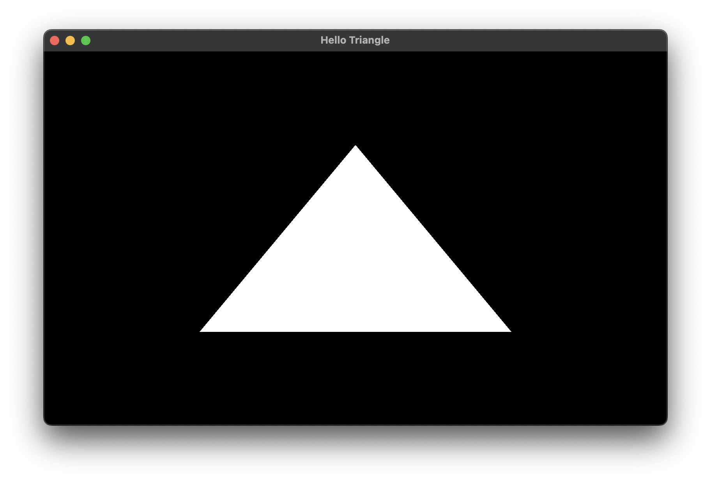

# OpenGLApp

[](https://opensource.org/licenses/MIT)

Boilderplate code for OpenGL + [GLEW](https://github.com/nigels-com/glew) + [GLFW](https://github.com/glfw/glfw).

# Usage

## Build using CMake

```cmake
include(FetchContent)
FetchContent_Declare(
    OpenGLApp
    GIT_REPOSITORY https://github.com/stripe2933/OpenGLApp.git
    GIT_TAG main
)
FetchContent_MakeAvailable(OpenGLApp)

target_link_libraries(${PROJECT_NAME} PRIVATE OpenGLApp) # Your target name goes to here.
```

Now you can use the library in your target.

## Code

See [example](https://github.com/stripe2933/OpenGLApp/blob/main/example/main.cpp) for the details. This program renders
a white triangle.

```cpp
#include <OpenGLApp/Window.hpp>
#include <OpenGLApp/Program.hpp>

class App : public OpenGL::Window{
private:
    static constexpr std::array<glm::vec2, 3> vertices {
        glm::vec2 { -0.5f, -0.5f },
        glm::vec2 { 0.5f, -0.5f },
        glm::vec2 { 0.0f,  0.5f }
    };

    OpenGL::Program program;
    GLuint vao, vbo;

    void update(float time_delta) override {

    }

    void draw() const override {
        glClear(GL_COLOR_BUFFER_BIT);

        program.use();
        glBindVertexArray(vao);
        glDrawArrays(GL_TRIANGLES, 0, 3);
    }

public:
    App() : Window { 800, 480, "Hello Triangle" },
            program { "shaders/white_triangle.vert", "shaders/white_triangle.frag" }
    {
        glGenVertexArrays(1, &vao);
        glBindVertexArray(vao);

        glGenBuffers(1, &vbo);
        glBindBuffer(GL_ARRAY_BUFFER, vbo);
        glBufferData(GL_ARRAY_BUFFER, sizeof(glm::vec2) * vertices.size(), vertices.data(), GL_STATIC_DRAW);

        glVertexAttribPointer(0, 2, GL_FLOAT, GL_FALSE, sizeof(glm::vec2), nullptr);
        glEnableVertexAttribArray(0);
    }

    ~App() noexcept override{
        // program is automatically destroyed using RAII pattern.
        glDeleteVertexArrays(1, &vao);
        glDeleteBuffers(1, &vbo);
    }
};

int main(){
    App{}.run();
}
```

