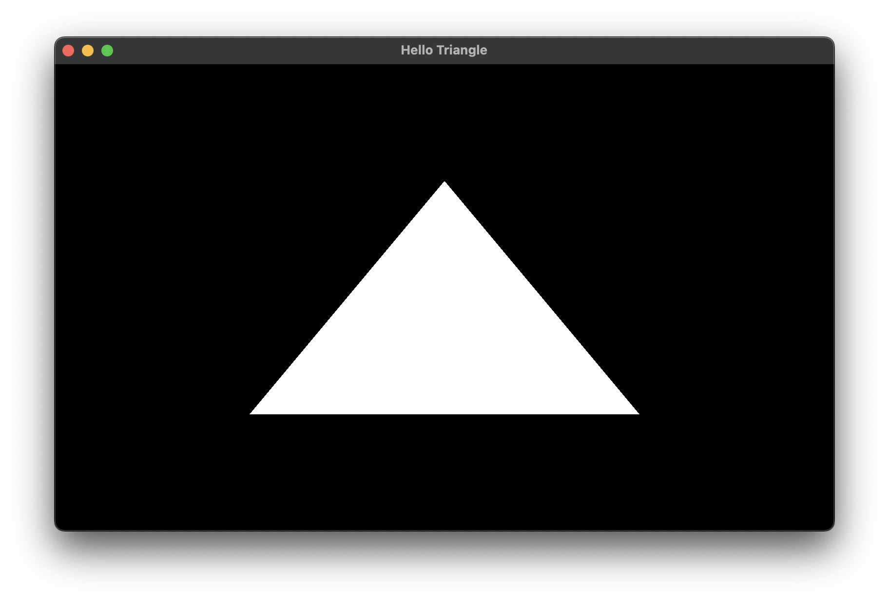

# OpenGLApp

[](https://opensource.org/licenses/MIT)

Boilderplate code for OpenGL + [GLEW](https://github.com/nigels-com/glew) + [GLFW](https://github.com/glfw/glfw).

# Usage

## Build using CMake

```cmake
include(FetchContent)
FetchContent_Declare(
    OpenGLApp
    GIT_REPOSITORY https://github.com/stripe2933/OpenGLApp.git
    GIT_TAG main
)
FetchContent_MakeAvailable(OpenGLApp)

target_link_libraries(${PROJECT_NAME} PRIVATE OpenGLApp) # Your target name goes to here.
```

Now you can use the library in your target.

## Code

See [example](https://github.com/stripe2933/OpenGLApp/blob/main/example/main.cpp) for the details. This program renders
a white triangle.

```cpp
#include <array>
#include <OpenGLWindow.hpp>

class HelloTriangle : public OpenGLWindow{
private:
    static constexpr const char *VERTEX_SHADER_SOURCE = R"(
        #version 330 core

        layout (location = 0) in vec2 aPos;

        void main(){
            gl_Position = vec4(aPos, 0.0, 1.0);
        }
    )";
    static constexpr const char *FRAGMENT_SHADER_SOURCE = R"(
        #version 330 core

        out vec4 fragColor;

        void main(){
            fragColor = vec4(1.0);
        }
    )";
    static constexpr std::array<float, 6> vertices {
        -0.5f, -0.5f,
         0.5f, -0.5f,
         0.0f,  0.5f
    };

    GLuint program, vao, vbo;

    void update(float time_delta) override {

    }

    void draw() const override {
        glClear(GL_COLOR_BUFFER_BIT);

        glUseProgram(program);
        glBindVertexArray(vao);
        glDrawArrays(GL_TRIANGLES, 0, 3);
    }

public:
    HelloTriangle() : OpenGLWindow { 800, 480, "Hello Triangle" } {
        GLuint vertex_shader = glCreateShader(GL_VERTEX_SHADER);
        glShaderSource(vertex_shader, 1, &VERTEX_SHADER_SOURCE, nullptr);
        glCompileShader(vertex_shader);

        GLuint fragment_shader = glCreateShader(GL_FRAGMENT_SHADER);
        glShaderSource(fragment_shader, 1, &FRAGMENT_SHADER_SOURCE, nullptr);
        glCompileShader(fragment_shader);

        program = glCreateProgram();
        glAttachShader(program, vertex_shader);
        glAttachShader(program, fragment_shader);
        glLinkProgram(program);

        glDeleteShader(vertex_shader);
        glDeleteShader(fragment_shader);

        glGenVertexArrays(1, &vao);
        glBindVertexArray(vao);

        glGenBuffers(1, &vbo);
        glBindBuffer(GL_ARRAY_BUFFER, vbo);
        glBufferData(GL_ARRAY_BUFFER, sizeof(float) * vertices.size(), vertices.data(), GL_STATIC_DRAW);

        glVertexAttribPointer(0, 2, GL_FLOAT, GL_FALSE, 2 * sizeof(float), nullptr);
        glEnableVertexAttribArray(0);
    }

    ~HelloTriangle() noexcept override{
        glDeleteProgram(program);
        glDeleteVertexArrays(1, &vao);
        glDeleteBuffers(1, &vbo);
    }
};

int main(){
    HelloTriangle{}.run();
}
```

